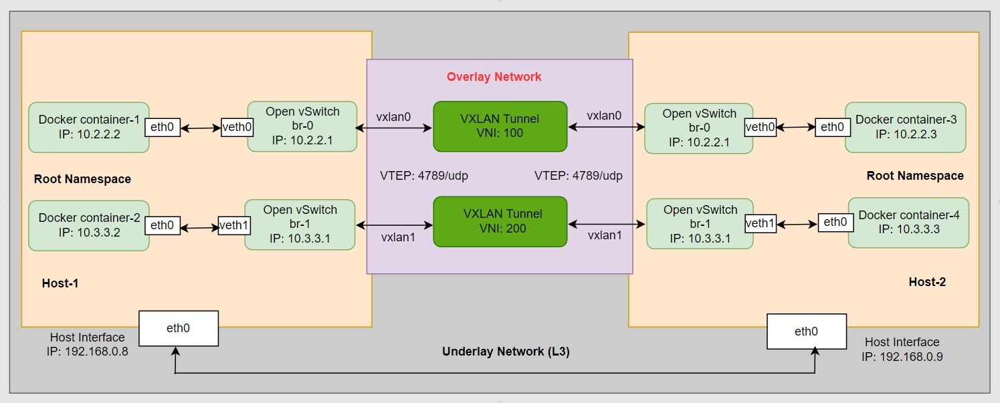

# Multi-hosts Container Networking: A Practical Guide to Open vSwitch, VXLAN, and Docker Overlay Networks:

Open vSwitch (OVS) is an open-source virtual switch that can be used to create software-defined networks. VXLAN (Virtual Extensible LAN) is a network overlay technology that allows you to extend Layer 2 (Ethernet) networks over an underlying Layer 3 (IP) network. By combining OVS with VXLAN, you can create virtual networks that span across physical hosts and facilitate communication between Docker containers running on different hosts.

## Topology of the Open-vSwtich-VXLAN and Docker: 


Here's a step-by-step guide to implementing Open vSwitch, VXLAN, and Docker Overlay Networks:

## Prerequisites:

- Linux-based operating system (e.g: Ubuntu, CentOS)
- Docker installed (docker.io) on all hosts
- Open vSwitch installed (openvswitch-switch) on all hosts
- Install necessary Tools: net-tools, iputils-ping 


## Step-1: Now create two bridges per Host using OpenVSwitch 'ovs-vsctl' cli utility:

### Host-1 and Host-2:
```
# Update the repository and install essential packages:

sudo apt update -y
sudo apt install docker.io net-tools iputils-ping -y
sudo apt install openvswitch-switch -y
```

```
# Create a virtual switch/bridge:

sudo ovs-vsctl add-br br0
sudo ovs-vsctl add-br br1
```

### Host-1 and Host-2:
```
# Add virtual interfaces 'veth0' & 'veth1' respectively to binding bridges 'br0' & 'br1', where type is 'internal':

sudo ovs-vsctl add-port br0 veth0 -- set interface veth0 type=internal

sudo ovs-vsctl add-port br1 veth1 -- set interface veth1 type=internal
```

### Host-1 and Host-2:
```
# Assign IP to the bridge interfaces and enable of the intefaces:

sudo ip address add 10.2.2.1/24 dev veth0 
sudo ip address add 10.3.3.1/24 dev veth1


sudo ip link set dev veth0 up mtu 1450
sudo ip link set dev veth1 up mtu 1450


# Check interface status:

sudo ip a
```

## Step-2: From this Dockerfile build the image first then run the containers. Set docker container with network 'none'. Also as containers we will see not getting any IP:

### Host-1 and Host-2:
```
# Create the custom Docker file:

vim Dockerfile

FROM ubuntu

RUN apt update
RUN apt install -y net-tools
RUN apt install -y iproute2
RUN apt install -y iputils-ping
```
:wq (save and quit)


```
# Build the image where name is 'ubuntu:v1':

sudo docker build -t ubuntu:v1 .


# Check the docker iamge:

sudo docker images
REPOSITORY   TAG       IMAGE ID       CREATED       SIZE
ubuntu       v1        d2035222bdb2   4 hours ago   126MB
```

### Host-1 and Host-2:
```
# Create Container on Host-1:

sudo docker run --name container1 -dit --net=none ubuntu:v1

sudo docker run --name container2 -dit --net=none ubuntu:v1
```

```
# For Host-1:
# Check container status with IP getting or not:

# For container1:

sudo docker exec -it container1 ip a

1: lo: <LOOPBACK,UP,LOWER_UP> mtu 65536 qdisc noqueue state UNKNOWN group default qlen 1000
    link/loopback 00:00:00:00:00:00 brd 00:00:00:00:00:00
    inet 127.0.0.1/8 scope host lo
       valid_lft forever preferred_lft forever


# For container2:

sudo docker exec -it container2 ip a

1: lo: <LOOPBACK,UP,LOWER_UP> mtu 65536 qdisc noqueue state UNKNOWN group default qlen 1000
    link/loopback 00:00:00:00:00:00 brd 00:00:00:00:00:00
    inet 127.0.0.1/8 scope host lo
       valid_lft forever preferred_lft forever
```

```
# Create Container on Host-2:

sudo docker run --name container3 -dit --net=none ubuntu:v1

sudo docker run --name container4 -dit --net=none ubuntu:v1
```

```
# For Host-2:
# Check container status with IP getting or not:

# For container3:

sudo docker exec -it container3 ip a

1: lo: <LOOPBACK,UP,LOWER_UP> mtu 65536 qdisc noqueue state UNKNOWN group default qlen 1000
    link/loopback 00:00:00:00:00:00 brd 00:00:00:00:00:00
    inet 127.0.0.1/8 scope host lo
       valid_lft forever preferred_lft forever


# For container4:

sudo docker exec -it container4 ip a

1: lo: <LOOPBACK,UP,LOWER_UP> mtu 65536 qdisc noqueue state UNKNOWN group default qlen 1000
    link/loopback 00:00:00:00:00:00 brd 00:00:00:00:00:00
    inet 127.0.0.1/8 scope host lo
       valid_lft forever preferred_lft forever
```

## Step-3: Now, assign the static IP to the containers using 'ovs-docker' utility. Also ping the gateway to test the connectivity:

### Host-1 and Host-2:
```
# For Host-1:

sudo ovs-docker add-port br0 eth0 container1 --ipaddress=10.2.2.2/24 --gateway=10.2.2.1 

sudo ovs-docker add-port br1 eth0 container2 --ipaddress=10.3.3.2/24 --gateway=10.3.3.1
```

```
# For Host-1:
# Check container status with IP getting or not:

sudo docker exec -it container1 ip a
sudo docker exec -it container2 ip a


# 'ping' to the gateway to check if container connected to ovs-bridges:

sudo docker exec -it container1 ping 10.2.2.1 
sudo docker exec -it container1 ping 10.2.2.2

sudo docker exec -it container2 ping 10.3.3.1
sudo docker exec -it container2 ping 10.3.3.2
```

```
# For Host-2:

sudo ovs-docker add-port br0 eth0 container3 --ipaddress=10.2.2.3/24 --gateway=10.2.2.1 

sudo ovs-docker add-port br1 eth0 container4 --ipaddress=10.3.3.3/24 --gateway=10.3.3.1
```

```
# For Host-2:
# Check container status with IP getting or not:

sudo docker exec -it container3 ip a
sudo docker exec -it container4 ip a


# 'ping' to the gateway to check if container connected to ovs-bridges:

sudo docker exec -it container3 ping 10.2.2.1
sudo docker exec -it container3 ping 10.2.2.3

sudo docker exec -it container4 ping 10.3.3.1
sudo docker exec -it container4 ping 10.3.3.3
```

## Step-4: Now, we are going to establish the VXLAN TUNNELING between the two Hosts (Host1 & Host-2). Also we have to configure the remote IP which is opposite host IP with VNI (VXLAN ID) and udp port 4789:

### Host-1 and Host-2:
```
# For Host-1, Create a VXLAN tunnel interface for both bridges (br0 & br1): 
# 'vxlan0' and 'vxlan1' is the interface/port name and key is VNI. 
# Make sure remote IP and key options they are important. 


sudo ovs-vsctl add-port br0 vxlan0 -- set interface vxlan0 type=vxlan options:remote_ip=192.168.0.9 options:key=100

sudo ovs-vsctl add-port br1 vxlan1 -- set interface vxlan1 type=vxlan options:remote_ip=192.168.0.9 options:key=200
```

```
# For Host-1:
# Check port status; it should be listening:

sudo netstat -tulpn | grep 4789


# Check open-vswitch status:

sudo ovs-vsctl show

```

```
# For Host-2, Create a VXLAN tunnel interface for both bridges (br0 & br1): 
# 'vxlan0' and 'vxlan1' is the interface/port name and key is VNI. 
# Make sure remote IP and key options they are important. 


sudo ovs-vsctl add-port br0 vxlan0 -- set interface vxlan0 type=vxlan options:remote_ip=192.168.0.8 options:key=100

sudo ovs-vsctl add-port br1 vxlan1 -- set interface vxlan1 type=vxlan options:remote_ip=192.168.0.8 options:key=200
```


```
# For Host-2:
# Check port status; it should be listening:

sudo netstat -tulpn | grep 4789


# Check open-vswitch status:

sudo ovs-vsctl show
```


## Step-5: Now, test the connectivity:

### Host-1 and Host-2:
```
# For Host-1:

# From container1 to container3 IP:
# Will get ping:

sudo docker exec -it container1 ping 10.2.2.3


# From container2 to container4 IP:
# Will get ping:

sudo docker exec -it container2 ping 10.3.3.3
```

```
# For Host-2:

# From container3 to container1 IP:
# Will get ping:

sudo docker exec -it container3 ping 10.2.2.2


# From container4 to container2 IP:
# Will get ping:

sudo docker exec -it container4 ping 10.3.3.2
```

_The VXLAN TUNNELING is working. We can reach the other host's docker conatiner with same VNI._

_This is a basic demonstration of using Open vSwitch with VXLAN and Docker to create an overlay network that spans across multiple hosts. In a real-world scenario, you would need to consider additional aspects such as security, routing, and proper network configurations._


## Step-6: But we can communicate between containers with same VNI, but can't reach the outer world or internet. Let's fix that by adding some iptables rules for NATing: (Optional)::

### Host-1 and Host-2:
```
# NAT Conncetivity for recahing to the internet:

sudo cat /proc/sys/net/ipv4/ip_forward


# Enabling ip forwarding by change value 0 to 1.

sudo sysctl -w net.ipv4.ip_forward=1
sudo sysctl -p /etc/sysctl.conf


# Again Check:

sudo cat /proc/sys/net/ipv4/ip_forward
```

```
# Check the IPtables on both hosts:

sudo iptables -t nat -L -n -v
```

```
# For 10.2.2.0/24 Network:

sudo iptables --append FORWARD --in-interface veth0 --jump ACCEPT
sudo iptables --append FORWARD --out-interface veth0 --jump ACCEPT
sudo iptables --table nat --append POSTROUTING --source 10.2.2.0/24 --jump MASQUERADE


# For 10.3.3.0/24 Network:

sudo iptables --append FORWARD --in-interface veth1 --jump ACCEPT
sudo iptables --append FORWARD --out-interface veth1 --jump ACCEPT
sudo iptables --table nat --append POSTROUTING --source 10.3.3.0/24 --jump MASQUERADE

```
```
# 'ping' the outer world or internet from inside of the containers and its should be working:

ping 8.8.8.8
ping 1.1.1.1
```


`See More:`
--
[MEDIUM](https://medium.com/@technbd)


